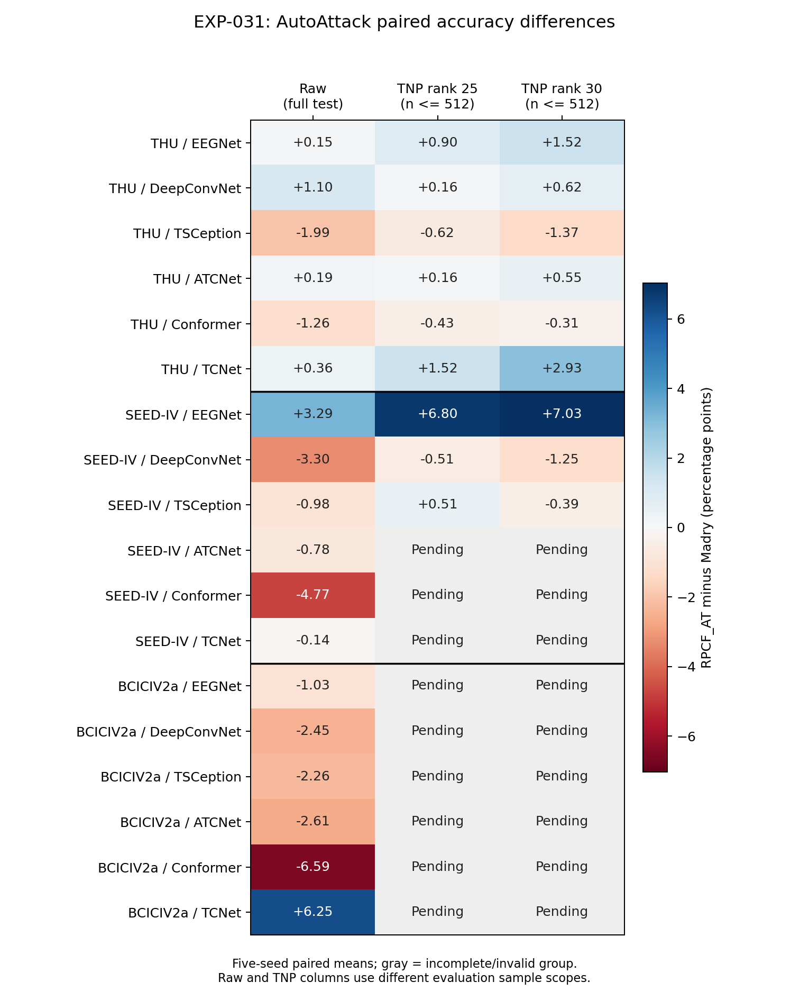

# EXP-031 现有结果报告

任务状态快照开始时间：2026-09-10T17:10:36；run：`exp031_full_20260729_174215`。统计固定使用开始时完成的任务，不混入报告生成期间新增完成项。

所有准确率均为五种子（42–46）均值 ± 样本标准差，单位 %，fold0。未满五种子的格子显示 Pending(n/5)，不以部分种子均值替代完整结果。

未净化为完整测试集；净化为确定性最多 n512 子集，两者不能直接相减。Clean 列统一取 AutoAttack 产物记录。普通 clean 训练模型及其 TNP 未纳入本实验；TRADES/FBF/EA-forward 的 TNP 也未纳入。

常规攻击针对各自分类器生成，不等于对净化—分类链路的自适应攻击。AA/FGSM/PGD 的 Linf epsilon=0.03；PGD200 alpha=2/255、无随机起点。CW 为 L2、200步、c=10000、kappa=1、lr=0.1，不受0.03的Linf约束。

本报告全量复核已保存产物的协议字段、状态、训练记录、样本索引和标签；每份TNP产物固定抽查第0、N/4、N/2、3N/4、N−1条clean/adv输入与攻击产物的一致性。未逐元素检查全部张量，也未重新执行分类推理或攻击，不将这些核对等同于独立复现实验。

方法标签：`madry` 为 Madry AT，`rpcf_at` 为全层静态六秩 RPCF_AT，`ea_forward` 为 EA-forward + Madry；`trades` 与 `fbf` 为对应 AT 对照。

## 完成范围

快照共 3073 项任务：2731 项完成（88.87%），342 项尚未完成，状态记录中失败为 0。全部 1800 项常规攻击已完成；TNP 为 378/720（52.50%）。下表未列出另有 3 项已完成的数据准备任务。任务完成比例不是剩余运行时间估计。

| 数据集 | 类型 | 完成 | 失败 | 未完成（含运行中） |
|---|---|---:|---:|---:|
| thubenchmark | train_standard | 90 | 0 | 0 |
| thubenchmark | train_ea | 30 | 0 | 0 |
| thubenchmark | rpcf_cache | 30 | 0 | 0 |
| thubenchmark | rpcf_at | 30 | 0 | 0 |
| thubenchmark | attack | 600 | 0 | 0 |
| thubenchmark | tnp | 240 | 0 | 0 |
| thubenchmark | bpda | 10 | 0 | 0 |
| seediv | train_standard | 90 | 0 | 0 |
| seediv | train_ea | 30 | 0 | 0 |
| seediv | rpcf_cache | 30 | 0 | 0 |
| seediv | rpcf_at | 30 | 0 | 0 |
| seediv | attack | 600 | 0 | 0 |
| seediv | tnp | 135 | 0 | 105 |
| bciciv2a | train_standard | 90 | 0 | 0 |
| bciciv2a | train_ea | 30 | 0 | 0 |
| bciciv2a | rpcf_cache | 30 | 0 | 0 |
| bciciv2a | rpcf_at | 30 | 0 | 0 |
| bciciv2a | attack | 600 | 0 | 0 |
| bciciv2a | tnp | 3 | 0 | 237 |

产物校验错误：0；raw Clean 跨攻击记录差异：65 条。具体见 audit_errors.json 与 warnings.csv。

## 结果解释边界

- 完成状态不等于方法有效；低准确率和大种子方差均保留原值，不剔除失败表现的种子。
- 比较 RPCF 额外收益使用 rpcf_minus_madry；比较净化收益使用同一 n512 子集的 tnp_minus_same_subset_raw，见 paired_summary.csv。
- 当前仅做描述性统计，没有显著性检验或认证鲁棒性结论；完整矩阵未完成前不宣称跨数据集普遍优势。

## 核心结果与研究判断

### 1. 未净化鲁棒性并非普遍提升

在 18 个完整五种子数据集—骨干组合中，RPCF_AT 相对 Madry 的完整测试集 AutoAttack 准确率平均差为正的有 6 个，为负的有 12 个。这不支持将该适配配置表述为普遍增强原始鲁棒性。

| 数据集 | 骨干 | RPCF−Madry AA差值（pp） | 正向种子数 |
|---|---|---:|---:|
| thubenchmark | eegnet | +0.15 ± 0.20 | 2/5 |
| thubenchmark | deepconvnet | +1.10 ± 1.52 | 4/5 |
| thubenchmark | tsception | -1.99 ± 1.46 | 0/5 |
| thubenchmark | atcnet | +0.19 ± 0.57 | 3/5 |
| thubenchmark | conformer | -1.26 ± 2.94 | 1/5 |
| thubenchmark | tcnet | +0.36 ± 1.03 | 3/5 |
| seediv | eegnet | +3.29 ± 3.68 | 4/5 |
| seediv | deepconvnet | -3.30 ± 0.96 | 0/5 |
| seediv | tsception | -0.98 ± 0.60 | 0/5 |
| seediv | atcnet | -0.78 ± 0.29 | 0/5 |
| seediv | conformer | -4.77 ± 1.36 | 0/5 |
| seediv | tcnet | -0.14 ± 0.15 | 0/5 |
| bciciv2a | eegnet | -1.03 ± 0.64 | 0/5 |
| bciciv2a | deepconvnet | -2.45 ± 0.91 | 0/5 |
| bciciv2a | tsception | -2.26 ± 0.88 | 0/5 |
| bciciv2a | atcnet | -2.61 ± 1.00 | 0/5 |
| bciciv2a | conformer | -6.59 ± 2.37 | 0/5 |
| bciciv2a | tcnet | +6.25 ± 5.44 | 5/5 |

### 2. 净化后的额外收益需要按条件判断

下表仅展示 Madry 与 RPCF 均通过校验、且各有五个种子的 AutoAttack 净化对比。正向平均差不等于统计显著，也不代表五个种子均改善；未完成的数据集—骨干条件不作外推。

| 数据集 | 骨干 | 秩 | RPCF+TNP−Madry+TNP（pp） | 正向种子数 |
|---|---|---:|---:|---:|
| thubenchmark | eegnet | 25 | +0.90 ± 1.40 | 3/5 |
| thubenchmark | eegnet | 30 | +1.52 ± 1.25 | 4/5 |
| thubenchmark | deepconvnet | 25 | +0.16 ± 1.48 | 3/5 |
| thubenchmark | deepconvnet | 30 | +0.62 ± 0.98 | 4/5 |
| thubenchmark | tsception | 25 | -0.62 ± 3.05 | 2/5 |
| thubenchmark | tsception | 30 | -1.37 ± 2.72 | 2/5 |
| thubenchmark | atcnet | 25 | +0.16 ± 0.86 | 1/5 |
| thubenchmark | atcnet | 30 | +0.55 ± 1.20 | 3/5 |
| thubenchmark | conformer | 25 | -0.43 ± 2.55 | 1/5 |
| thubenchmark | conformer | 30 | -0.31 ± 2.76 | 1/5 |
| thubenchmark | tcnet | 25 | +1.52 ± 1.62 | 4/5 |
| thubenchmark | tcnet | 30 | +2.93 ± 3.53 | 3/5 |
| seediv | eegnet | 25 | +6.80 ± 6.43 | 4/5 |
| seediv | eegnet | 30 | +7.03 ± 6.45 | 4/5 |
| seediv | deepconvnet | 25 | -0.51 ± 1.41 | 1/5 |
| seediv | deepconvnet | 30 | -1.25 ± 1.48 | 1/5 |
| seediv | tsception | 25 | +0.51 ± 1.80 | 2/5 |
| seediv | tsception | 30 | -0.39 ± 1.07 | 2/5 |

图中数值为 RPCF 相对 Madry 的平均准确率差，蓝色为正、红色为负；灰色为未形成完整五种子组。Raw列和TNP列的样本范围不同，不能通过列间相减计算净化收益。

### 3. 区分净化作用与分类器适配作用

`paired_summary.csv` 同时给出两类比较：`rpcf_minus_madry` 衡量适配的额外差异；`tnp_minus_same_subset_raw` 衡量同一模型、同一攻击样本子集的净化前后变化。较大的净化前后提升不能全部归因于 RPCF。

当前较值得继续验证的是 SEED-IV/EEGNet：RPCF+TNP 在 AutoAttack 下相对 Madry+TNP 的平均优势为 rank25 的 +6.80 pp 和 rank30 的 +7.03 pp，但配对差值标准差也达到 6.43/6.45 pp，各有 4/5 个种子为正。因此这是条件性的正向证据，尚不能称为稳定的跨骨干优势。

不能仅依据 AutoAttack 总结所有攻击。以 THUBenchmark/DeepConvNet 为例，rank25 下 AutoAttack 从 Madry+TNP 的 80.86% 变为 RPCF+TNP 的 81.02%，但 CW-L2 从 16.68% 降至 5.12%；rank30 的 CW-L2 也从 7.54% 降至 2.23%。这说明额外适配收益具有攻击依赖性，且必须同时检查 Clean 保真度与各攻击指标。CW 与 Linf 攻击的约束不同，不宜把它们横向视为等强度攻击。

### 4. 异常项与结论边界

- 原始 Clean 记录异常筛查：对全部方法标记 Clean均值<5%或标准差>10 pp 的组合，以便后续核对训练收敛和评估流程。该筛查不检查低鲁棒准确率，不自动剔除种子，也不推断失败原因。

| 数据集 | 骨干 | 方法 | Clean（%） |
|---|---|---|---:|
| thubenchmark | tsception | ea_forward | 1.78 ± 0.23 |
| thubenchmark | atcnet | ea_forward | 78.19 ± 42.12 |
| thubenchmark | conformer | ea_forward | 58.34 ± 51.03 |
| thubenchmark | tcnet | ea_forward | 2.06 ± 0.64 |

- `warnings.csv` 记录同条件不同攻击任务的原始 Clean 准确率差异。该差异尚未解释，不能视为攻击对 clean 数据产生了效果；主表固定取 AutoAttack 记录，正式发表前应核对。
- BPDA 仅覆盖 THUBenchmark/EEGNet/RPCF_AT 的五种子和两个秩；没有 Madry BPDA 对照，且使用10步identity surrogate，不证明全矩阵自适应鲁棒性。
- 普通 clean-only 模型及其 TNP 未纳入计划，因此本报告不能回答它们与 AT+TNP 的优劣；需补同协议实验后才能形成该对照。
- 表格是对保存产物的重新整理与一致性检查，并未重跑攻击或分类评估。若存在产物校验错误，必须先处理后再作最终验收。

### 后续优先事项

1. 完成 SEED-IV 与 BCICIV2a 的净化矩阵，继续按完整五种子配对比较，不使用部分种子均值替代。
2. 核查 EA-forward 的退化/高方差条件以及 raw Clean 的跨任务差异。
3. 若论文需要普通模型+TNP 对照或更强自适应攻击证据，另行明确补实验协议后执行；本次仅生成报告，没有新增这些实验。

## 完整方法对比表

### thubenchmark / eegnet

未净化：完整测试集。

| 方法 | Clean | AutoAttack | FGSM | PGD-200 | CW-L2 |
|---|---:|---:|---:|---:|---:|
| madry | 92.94 ± 0.82 | 77.81 ± 0.63 | 79.49 ± 0.96 | 78.65 ± 0.91 | 0.00 ± 0.00 |
| rpcf_at | 93.01 ± 0.91 | 77.96 ± 0.60 | 79.64 ± 0.64 | 78.58 ± 0.94 | 0.00 ± 0.00 |
| trades | 93.54 ± 0.49 | 66.72 ± 0.49 | 69.31 ± 0.86 | 67.03 ± 0.57 | 0.00 ± 0.00 |
| fbf | 94.01 ± 1.29 | 56.35 ± 2.05 | 59.77 ± 1.05 | 56.42 ± 2.07 | 0.00 ± 0.00 |
| ea_forward | 96.31 ± 0.72 | 28.34 ± 0.69 | 52.91 ± 1.12 | 30.87 ± 1.37 | 0.00 ± 0.00 |

净化：确定性 n512 子集。

| 方法 | 秩 | Clean | AutoAttack | FGSM | PGD-200 | CW-L2 |
|---|---:|---:|---:|---:|---:|---:|
| madry+TNP | 25 | 90.27 ± 0.88 | 81.88 ± 2.22 | 79.57 ± 1.11 | 79.14 ± 0.94 | 25.86 ± 1.85 |
| rpcf_at+TNP | 25 | 90.31 ± 1.05 | 82.77 ± 1.44 | 81.76 ± 1.24 | 81.95 ± 1.14 | 26.76 ± 1.78 |
| madry+TNP | 30 | 90.94 ± 1.06 | 80.78 ± 1.64 | 79.88 ± 2.48 | 79.49 ± 1.97 | 18.71 ± 1.58 |
| rpcf_at+TNP | 30 | 91.17 ± 1.05 | 82.30 ± 1.67 | 81.76 ± 1.52 | 81.41 ± 1.10 | 18.95 ± 1.73 |
| clean-only+TNP | 25/30 | 未纳入 | 未纳入 | 未纳入 | 未纳入 | 未纳入 |

### thubenchmark / deepconvnet

未净化：完整测试集。

| 方法 | Clean | AutoAttack | FGSM | PGD-200 | CW-L2 |
|---|---:|---:|---:|---:|---:|
| madry | 93.47 ± 0.63 | 75.84 ± 1.71 | 78.44 ± 1.69 | 76.21 ± 1.61 | 0.00 ± 0.00 |
| rpcf_at | 94.02 ± 0.57 | 76.94 ± 1.53 | 79.45 ± 1.66 | 77.11 ± 1.48 | 0.00 ± 0.00 |
| trades | 94.29 ± 0.95 | 66.35 ± 3.43 | 70.04 ± 2.62 | 66.52 ± 3.26 | 0.00 ± 0.00 |
| fbf | 93.93 ± 0.67 | 55.03 ± 3.24 | 61.81 ± 2.31 | 55.42 ± 3.34 | 0.00 ± 0.00 |
| ea_forward | 96.05 ± 0.77 | 17.08 ± 1.13 | 38.80 ± 1.93 | 7.89 ± 0.43 | 0.00 ± 0.00 |

净化：确定性 n512 子集。

| 方法 | 秩 | Clean | AutoAttack | FGSM | PGD-200 | CW-L2 |
|---|---:|---:|---:|---:|---:|---:|
| madry+TNP | 25 | 90.43 ± 1.00 | 80.86 ± 1.69 | 78.75 ± 1.55 | 78.59 ± 1.06 | 16.68 ± 8.00 |
| rpcf_at+TNP | 25 | 91.52 ± 0.74 | 81.02 ± 1.56 | 79.22 ± 1.28 | 78.71 ± 1.53 | 5.12 ± 2.31 |
| madry+TNP | 30 | 91.29 ± 1.16 | 80.12 ± 1.30 | 78.67 ± 1.56 | 77.81 ± 1.39 | 7.54 ± 5.41 |
| rpcf_at+TNP | 30 | 92.15 ± 0.83 | 80.74 ± 1.05 | 79.41 ± 1.09 | 78.20 ± 1.17 | 2.23 ± 1.29 |
| clean-only+TNP | 25/30 | 未纳入 | 未纳入 | 未纳入 | 未纳入 | 未纳入 |

### thubenchmark / tsception

未净化：完整测试集。

| 方法 | Clean | AutoAttack | FGSM | PGD-200 | CW-L2 |
|---|---:|---:|---:|---:|---:|
| madry | 79.63 ± 2.31 | 36.60 ± 3.31 | 48.82 ± 2.92 | 40.39 ± 2.87 | 0.19 ± 0.14 |
| rpcf_at | 79.25 ± 0.79 | 34.61 ± 2.39 | 46.05 ± 1.85 | 36.91 ± 2.42 | 0.40 ± 0.29 |
| trades | 78.99 ± 2.50 | 9.09 ± 1.67 | 17.07 ± 1.69 | 9.69 ± 1.75 | 0.79 ± 0.34 |
| fbf | 79.33 ± 0.77 | 5.04 ± 1.90 | 12.08 ± 2.15 | 5.67 ± 1.95 | 1.96 ± 1.22 |
| ea_forward | 1.78 ± 0.23 | 1.75 ± 0.23 | 1.78 ± 0.23 | 1.75 ± 0.23 | 1.75 ± 0.23 |

净化：确定性 n512 子集。

| 方法 | 秩 | Clean | AutoAttack | FGSM | PGD-200 | CW-L2 |
|---|---:|---:|---:|---:|---:|---:|
| madry+TNP | 25 | 74.06 ± 0.99 | 49.49 ± 2.99 | 52.89 ± 2.42 | 48.71 ± 2.24 | 15.70 ± 2.67 |
| rpcf_at+TNP | 25 | 74.92 ± 0.78 | 48.87 ± 1.56 | 51.33 ± 1.95 | 46.37 ± 1.18 | 16.25 ± 1.88 |
| madry+TNP | 30 | 75.31 ± 1.45 | 47.62 ± 2.70 | 52.38 ± 1.79 | 47.07 ± 1.76 | 10.62 ± 1.79 |
| rpcf_at+TNP | 30 | 75.78 ± 0.84 | 46.25 ± 0.70 | 50.00 ± 1.44 | 45.12 ± 0.84 | 10.74 ± 1.04 |
| clean-only+TNP | 25/30 | 未纳入 | 未纳入 | 未纳入 | 未纳入 | 未纳入 |

### thubenchmark / atcnet

未净化：完整测试集。

| 方法 | Clean | AutoAttack | FGSM | PGD-200 | CW-L2 |
|---|---:|---:|---:|---:|---:|
| madry | 95.41 ± 0.46 | 85.65 ± 1.34 | 86.71 ± 1.69 | 86.13 ± 1.46 | 0.00 ± 0.00 |
| rpcf_at | 95.87 ± 0.56 | 85.84 ± 1.51 | 86.89 ± 1.21 | 85.96 ± 1.39 | 0.02 ± 0.05 |
| trades | 95.66 ± 0.56 | 78.76 ± 2.29 | 81.15 ± 2.16 | 78.81 ± 2.24 | 0.07 ± 0.11 |
| fbf | 96.09 ± 0.45 | 70.05 ± 1.48 | 73.53 ± 1.21 | 70.34 ± 1.51 | 0.00 ± 0.00 |
| ea_forward | 78.19 ± 42.12 | 26.59 ± 14.53 | 48.41 ± 26.88 | 22.62 ± 12.67 | 0.36 ± 0.80 |

净化：确定性 n512 子集。

| 方法 | 秩 | Clean | AutoAttack | FGSM | PGD-200 | CW-L2 |
|---|---:|---:|---:|---:|---:|---:|
| madry+TNP | 25 | 92.46 ± 0.35 | 86.76 ± 1.48 | 83.52 ± 1.04 | 82.97 ± 1.61 | 39.26 ± 2.48 |
| rpcf_at+TNP | 25 | 93.28 ± 0.71 | 86.91 ± 1.33 | 84.92 ± 1.01 | 84.34 ± 1.29 | 33.87 ± 7.02 |
| madry+TNP | 30 | 93.55 ± 0.73 | 86.56 ± 1.43 | 84.30 ± 1.31 | 83.52 ± 1.44 | 28.20 ± 1.49 |
| rpcf_at+TNP | 30 | 93.79 ± 0.45 | 87.11 ± 1.69 | 85.04 ± 1.47 | 84.77 ± 1.30 | 23.83 ± 5.09 |
| clean-only+TNP | 25/30 | 未纳入 | 未纳入 | 未纳入 | 未纳入 | 未纳入 |

### thubenchmark / conformer

未净化：完整测试集。

| 方法 | Clean | AutoAttack | FGSM | PGD-200 | CW-L2 |
|---|---:|---:|---:|---:|---:|
| madry | 94.03 ± 0.62 | 74.65 ± 1.52 | 80.15 ± 1.42 | 75.60 ± 1.47 | 0.00 ± 0.00 |
| rpcf_at | 93.47 ± 0.49 | 73.39 ± 2.22 | 78.16 ± 1.99 | 74.18 ± 1.98 | 0.00 ± 0.00 |
| trades | 95.03 ± 0.53 | 54.22 ± 16.16 | 73.92 ± 8.85 | 57.62 ± 10.39 | 0.02 ± 0.06 |
| fbf | 93.95 ± 1.09 | 49.49 ± 0.72 | 67.91 ± 5.81 | 57.15 ± 6.39 | 0.00 ± 0.00 |
| ea_forward | 58.34 ± 51.03 | 12.70 ± 10.34 | 35.48 ± 31.12 | 10.40 ± 8.44 | 0.40 ± 0.91 |

净化：确定性 n512 子集。

| 方法 | 秩 | Clean | AutoAttack | FGSM | PGD-200 | CW-L2 |
|---|---:|---:|---:|---:|---:|---:|
| madry+TNP | 25 | 91.33 ± 0.71 | 80.31 ± 1.90 | 80.86 ± 1.47 | 79.06 ± 1.93 | 17.89 ± 3.54 |
| rpcf_at+TNP | 25 | 90.78 ± 0.59 | 79.88 ± 1.57 | 79.69 ± 0.95 | 78.44 ± 1.87 | 25.00 ± 2.85 |
| madry+TNP | 30 | 92.03 ± 0.38 | 79.53 ± 2.22 | 80.86 ± 1.62 | 78.28 ± 1.67 | 12.38 ± 3.36 |
| rpcf_at+TNP | 30 | 91.13 ± 0.78 | 79.22 ± 1.56 | 79.77 ± 1.14 | 78.28 ± 1.22 | 18.05 ± 2.46 |
| clean-only+TNP | 25/30 | 未纳入 | 未纳入 | 未纳入 | 未纳入 | 未纳入 |

### thubenchmark / tcnet

未净化：完整测试集。

| 方法 | Clean | AutoAttack | FGSM | PGD-200 | CW-L2 |
|---|---:|---:|---:|---:|---:|
| madry | 83.37 ± 1.45 | 43.22 ± 3.13 | 55.00 ± 2.26 | 50.13 ± 3.21 | 3.34 ± 0.72 |
| rpcf_at | 83.80 ± 1.57 | 43.58 ± 2.75 | 55.46 ± 3.04 | 49.74 ± 2.78 | 3.46 ± 1.25 |
| trades | 85.91 ± 2.03 | 22.03 ± 2.34 | 36.66 ± 3.18 | 24.75 ± 2.49 | 6.24 ± 1.42 |
| fbf | 86.65 ± 1.71 | 21.02 ± 1.00 | 37.63 ± 1.49 | 24.11 ± 2.05 | 7.46 ± 1.93 |
| ea_forward | 2.06 ± 0.64 | 0.24 ± 0.15 | 1.07 ± 1.31 | 0.00 ± 0.00 | 1.61 ± 0.72 |

净化：确定性 n512 子集。

| 方法 | 秩 | Clean | AutoAttack | FGSM | PGD-200 | CW-L2 |
|---|---:|---:|---:|---:|---:|---:|
| madry+TNP | 25 | 78.09 ± 1.56 | 59.22 ± 3.17 | 57.38 ± 3.43 | 56.25 ± 4.11 | 8.95 ± 1.11 |
| rpcf_at+TNP | 25 | 78.52 ± 1.51 | 60.74 ± 3.64 | 60.31 ± 4.02 | 58.79 ± 2.85 | 8.36 ± 1.34 |
| madry+TNP | 30 | 78.91 ± 1.53 | 56.05 ± 3.27 | 57.66 ± 3.41 | 55.35 ± 3.20 | 6.37 ± 1.26 |
| rpcf_at+TNP | 30 | 79.92 ± 1.78 | 58.98 ± 4.07 | 59.88 ± 3.98 | 57.97 ± 3.63 | 5.78 ± 0.97 |
| clean-only+TNP | 25/30 | 未纳入 | 未纳入 | 未纳入 | 未纳入 | 未纳入 |

### seediv / eegnet

未净化：完整测试集。

| 方法 | Clean | AutoAttack | FGSM | PGD-200 | CW-L2 |
|---|---:|---:|---:|---:|---:|
| madry | 35.01 ± 2.73 | 23.82 ± 4.33 | 26.02 ± 3.74 | 25.99 ± 3.70 | 3.20 ± 3.62 |
| rpcf_at | 36.94 ± 1.82 | 27.11 ± 1.01 | 28.63 ± 1.13 | 28.64 ± 1.15 | 0.33 ± 0.41 |
| trades | 57.87 ± 1.36 | 1.61 ± 0.12 | 2.36 ± 0.18 | 1.91 ± 0.14 | 0.02 ± 0.01 |
| fbf | 53.20 ± 0.70 | 8.00 ± 0.88 | 10.61 ± 1.14 | 9.96 ± 1.01 | 0.01 ± 0.01 |
| ea_forward | 27.59 ± 0.61 | 21.97 ± 5.03 | 24.32 ± 2.82 | 21.80 ± 4.82 | 4.41 ± 4.15 |

净化：确定性 n512 子集。

| 方法 | 秩 | Clean | AutoAttack | FGSM | PGD-200 | CW-L2 |
|---|---:|---:|---:|---:|---:|---:|
| madry+TNP | 25 | 33.67 ± 4.52 | 27.73 ± 6.31 | 26.25 ± 4.55 | 26.41 ± 4.47 | 3.98 ± 2.40 |
| rpcf_at+TNP | 25 | 36.91 ± 3.37 | 34.53 ± 2.72 | 30.47 ± 2.40 | 30.27 ± 2.39 | 2.93 ± 0.95 |
| madry+TNP | 30 | 33.67 ± 4.39 | 26.80 ± 6.75 | 26.09 ± 4.32 | 26.29 ± 4.40 | 3.16 ± 3.05 |
| rpcf_at+TNP | 30 | 36.76 ± 3.35 | 33.83 ± 2.55 | 29.65 ± 2.64 | 29.53 ± 2.50 | 1.05 ± 0.94 |
| clean-only+TNP | 25/30 | 未纳入 | 未纳入 | 未纳入 | 未纳入 | 未纳入 |

### seediv / deepconvnet

未净化：完整测试集。

| 方法 | Clean | AutoAttack | FGSM | PGD-200 | CW-L2 |
|---|---:|---:|---:|---:|---:|
| madry | 43.61 ± 0.70 | 21.63 ± 1.38 | 23.76 ± 1.29 | 23.33 ± 1.31 | 0.14 ± 0.05 |
| rpcf_at | 43.99 ± 0.86 | 18.33 ± 0.73 | 20.99 ± 0.66 | 20.23 ± 0.72 | 0.20 ± 0.08 |
| trades | 58.49 ± 2.13 | 0.82 ± 0.20 | 1.45 ± 0.22 | 0.83 ± 0.19 | 0.10 ± 0.11 |
| fbf | 55.85 ± 0.90 | 3.56 ± 0.71 | 5.53 ± 0.72 | 4.15 ± 0.93 | 0.02 ± 0.01 |
| ea_forward | 33.98 ± 4.87 | 21.57 ± 2.67 | 16.74 ± 2.19 | 12.40 ± 1.82 | 0.30 ± 0.58 |

净化：确定性 n512 子集。

| 方法 | 秩 | Clean | AutoAttack | FGSM | PGD-200 | CW-L2 |
|---|---:|---:|---:|---:|---:|---:|
| madry+TNP | 25 | 39.80 ± 2.37 | 30.55 ± 1.72 | 25.43 ± 2.60 | 25.47 ± 2.61 | 10.47 ± 3.35 |
| rpcf_at+TNP | 25 | 41.09 ± 1.29 | 30.04 ± 1.38 | 24.96 ± 1.55 | 24.77 ± 1.79 | 8.83 ± 3.46 |
| madry+TNP | 30 | 40.31 ± 2.42 | 30.00 ± 1.44 | 25.66 ± 2.03 | 25.35 ± 1.97 | 7.15 ± 3.26 |
| rpcf_at+TNP | 30 | 41.41 ± 0.98 | 28.75 ± 1.38 | 24.38 ± 1.71 | 24.77 ± 1.28 | 6.09 ± 2.88 |
| clean-only+TNP | 25/30 | 未纳入 | 未纳入 | 未纳入 | 未纳入 | 未纳入 |

### seediv / tsception

未净化：完整测试集。

| 方法 | Clean | AutoAttack | FGSM | PGD-200 | CW-L2 |
|---|---:|---:|---:|---:|---:|
| madry | 49.07 ± 0.92 | 30.49 ± 0.74 | 34.71 ± 1.00 | 33.94 ± 0.86 | 0.30 ± 0.26 |
| rpcf_at | 49.49 ± 0.47 | 29.50 ± 0.70 | 33.76 ± 0.55 | 32.93 ± 0.45 | 0.25 ± 0.31 |
| trades | 65.66 ± 0.96 | 0.44 ± 0.10 | 1.14 ± 0.27 | 0.49 ± 0.11 | 0.02 ± 0.03 |
| fbf | 64.66 ± 0.57 | 2.73 ± 0.34 | 6.77 ± 0.54 | 3.56 ± 0.45 | 0.13 ± 0.11 |
| ea_forward | 27.05 ± 0.21 | 27.05 ± 0.21 | 27.06 ± 0.22 | 27.05 ± 0.21 | 27.06 ± 0.22 |

净化：确定性 n512 子集。

| 方法 | 秩 | Clean | AutoAttack | FGSM | PGD-200 | CW-L2 |
|---|---:|---:|---:|---:|---:|---:|
| madry+TNP | 25 | 45.47 ± 1.71 | 39.80 ± 2.46 | 34.96 ± 2.67 | 35.12 ± 2.26 | 3.59 ± 1.06 |
| rpcf_at+TNP | 25 | 46.56 ± 3.88 | 40.31 ± 3.65 | 35.66 ± 3.40 | 35.62 ± 3.09 | 4.26 ± 1.92 |
| madry+TNP | 30 | 45.86 ± 1.40 | 39.41 ± 2.28 | 34.88 ± 2.50 | 35.16 ± 2.63 | 1.29 ± 0.61 |
| rpcf_at+TNP | 30 | 46.84 ± 3.19 | 39.02 ± 2.75 | 35.62 ± 3.29 | 35.47 ± 3.54 | 1.37 ± 0.72 |
| clean-only+TNP | 25/30 | 未纳入 | 未纳入 | 未纳入 | 未纳入 | 未纳入 |

### seediv / atcnet

未净化：完整测试集。

| 方法 | Clean | AutoAttack | FGSM | PGD-200 | CW-L2 |
|---|---:|---:|---:|---:|---:|
| madry | 44.97 ± 1.21 | 26.69 ± 0.86 | 29.21 ± 0.95 | 28.93 ± 0.97 | 0.24 ± 0.32 |
| rpcf_at | 45.01 ± 1.07 | 25.91 ± 0.63 | 28.53 ± 0.86 | 28.29 ± 0.81 | 0.16 ± 0.24 |
| trades | 61.98 ± 0.45 | 1.83 ± 0.22 | 3.30 ± 0.47 | 1.88 ± 0.23 | 0.10 ± 0.14 |
| fbf | 56.62 ± 1.69 | 5.37 ± 0.45 | 8.23 ± 0.57 | 5.95 ± 0.48 | 0.01 ± 0.01 |
| ea_forward | 32.02 ± 3.09 | 24.39 ± 6.72 | 20.30 ± 5.78 | 16.75 ± 6.35 | 5.43 ± 2.70 |

净化：确定性 n512 子集。

| 方法 | 秩 | Clean | AutoAttack | FGSM | PGD-200 | CW-L2 |
|---|---:|---:|---:|---:|---:|---:|
| madry+TNP | 25 | Pending (2/5) | Pending (2/5) | Pending (2/5) | Pending (2/5) | Pending (2/5) |
| rpcf_at+TNP | 25 | Pending (2/5) | Pending (2/5) | Pending (2/5) | Pending (2/5) | Pending (1/5) |
| madry+TNP | 30 | Pending (2/5) | Pending (2/5) | Pending (2/5) | Pending (2/5) | Pending (2/5) |
| rpcf_at+TNP | 30 | Pending (2/5) | Pending (2/5) | Pending (2/5) | Pending (2/5) | Pending (1/5) |
| clean-only+TNP | 25/30 | 未纳入 | 未纳入 | 未纳入 | 未纳入 | 未纳入 |

### seediv / conformer

未净化：完整测试集。

| 方法 | Clean | AutoAttack | FGSM | PGD-200 | CW-L2 |
|---|---:|---:|---:|---:|---:|
| madry | 60.88 ± 2.12 | 31.42 ± 1.20 | 38.76 ± 0.98 | 35.17 ± 0.80 | 27.84 ± 15.93 |
| rpcf_at | 59.50 ± 2.40 | 26.65 ± 2.06 | 33.65 ± 2.33 | 29.39 ± 2.10 | 25.31 ± 15.17 |
| trades | 69.43 ± 1.06 | 0.05 ± 0.04 | 38.17 ± 5.14 | 24.50 ± 7.64 | 14.09 ± 3.24 |
| fbf | 66.05 ± 1.58 | 4.19 ± 1.05 | 12.54 ± 0.79 | 5.38 ± 1.14 | 9.32 ± 5.58 |
| ea_forward | 34.44 ± 2.90 | 27.51 ± 3.76 | 21.52 ± 4.09 | 17.15 ± 3.05 | 17.02 ± 5.50 |

净化：确定性 n512 子集。

| 方法 | 秩 | Clean | AutoAttack | FGSM | PGD-200 | CW-L2 |
|---|---:|---:|---:|---:|---:|---:|
| madry+TNP | 25 | Pending (0/5) | Pending (0/5) | Pending (0/5) | Pending (0/5) | Pending (0/5) |
| rpcf_at+TNP | 25 | Pending (0/5) | Pending (0/5) | Pending (0/5) | Pending (0/5) | Pending (0/5) |
| madry+TNP | 30 | Pending (0/5) | Pending (0/5) | Pending (0/5) | Pending (0/5) | Pending (0/5) |
| rpcf_at+TNP | 30 | Pending (0/5) | Pending (0/5) | Pending (0/5) | Pending (0/5) | Pending (0/5) |
| clean-only+TNP | 25/30 | 未纳入 | 未纳入 | 未纳入 | 未纳入 | 未纳入 |

### seediv / tcnet

未净化：完整测试集。

| 方法 | Clean | AutoAttack | FGSM | PGD-200 | CW-L2 |
|---|---:|---:|---:|---:|---:|
| madry | 41.75 ± 1.20 | 30.31 ± 0.28 | 32.79 ± 0.26 | 32.18 ± 0.32 | 0.58 ± 0.84 |
| rpcf_at | 41.93 ± 1.24 | 30.17 ± 0.21 | 32.67 ± 0.26 | 32.02 ± 0.10 | 0.63 ± 0.77 |
| trades | 62.38 ± 1.29 | 0.35 ± 0.26 | 1.34 ± 0.45 | 0.41 ± 0.25 | 0.82 ± 0.24 |
| fbf | 56.82 ± 1.04 | 5.38 ± 0.51 | 12.30 ± 1.07 | 6.59 ± 0.69 | 0.74 ± 0.17 |
| ea_forward | 33.41 ± 4.06 | 22.90 ± 2.66 | 25.33 ± 1.99 | 19.37 ± 3.89 | 9.35 ± 9.47 |

净化：确定性 n512 子集。

| 方法 | 秩 | Clean | AutoAttack | FGSM | PGD-200 | CW-L2 |
|---|---:|---:|---:|---:|---:|---:|
| madry+TNP | 25 | Pending (0/5) | Pending (0/5) | Pending (0/5) | Pending (0/5) | Pending (0/5) |
| rpcf_at+TNP | 25 | Pending (0/5) | Pending (0/5) | Pending (0/5) | Pending (0/5) | Pending (0/5) |
| madry+TNP | 30 | Pending (0/5) | Pending (0/5) | Pending (0/5) | Pending (0/5) | Pending (0/5) |
| rpcf_at+TNP | 30 | Pending (0/5) | Pending (0/5) | Pending (0/5) | Pending (0/5) | Pending (0/5) |
| clean-only+TNP | 25/30 | 未纳入 | 未纳入 | 未纳入 | 未纳入 | 未纳入 |

### bciciv2a / eegnet

未净化：完整测试集。

| 方法 | Clean | AutoAttack | FGSM | PGD-200 | CW-L2 |
|---|---:|---:|---:|---:|---:|
| madry | 50.57 ± 3.33 | 27.43 ± 2.46 | 30.19 ± 2.93 | 30.15 ± 2.89 | 0.08 ± 0.17 |
| rpcf_at | 50.38 ± 3.12 | 26.40 ± 2.40 | 28.51 ± 2.97 | 28.39 ± 2.90 | 0.00 ± 0.00 |
| trades | 68.05 ± 2.06 | 3.64 ± 0.54 | 4.87 ± 0.83 | 3.95 ± 0.60 | 0.00 ± 0.00 |
| fbf | 65.90 ± 2.44 | 6.67 ± 0.88 | 8.12 ± 1.02 | 7.01 ± 0.70 | 0.00 ± 0.00 |
| ea_forward | 28.62 ± 2.98 | 0.34 ± 0.31 | 0.00 ± 0.00 | 0.00 ± 0.00 | 21.03 ± 5.48 |

净化：确定性 n512 子集。

| 方法 | 秩 | Clean | AutoAttack | FGSM | PGD-200 | CW-L2 |
|---|---:|---:|---:|---:|---:|---:|
| madry+TNP | 25 | Pending (2/5) | Pending (2/5) | Pending (0/5) | Pending (0/5) | Pending (0/5) |
| rpcf_at+TNP | 25 | Pending (0/5) | Pending (0/5) | Pending (0/5) | Pending (0/5) | Pending (0/5) |
| madry+TNP | 30 | Pending (2/5) | Pending (2/5) | Pending (0/5) | Pending (0/5) | Pending (0/5) |
| rpcf_at+TNP | 30 | Pending (0/5) | Pending (0/5) | Pending (0/5) | Pending (0/5) | Pending (0/5) |
| clean-only+TNP | 25/30 | 未纳入 | 未纳入 | 未纳入 | 未纳入 | 未纳入 |

### bciciv2a / deepconvnet

未净化：完整测试集。

| 方法 | Clean | AutoAttack | FGSM | PGD-200 | CW-L2 |
|---|---:|---:|---:|---:|---:|
| madry | 42.07 ± 2.07 | 15.48 ± 1.85 | 17.78 ± 2.26 | 17.20 ± 2.14 | 0.00 ± 0.00 |
| rpcf_at | 42.18 ± 1.38 | 13.03 ± 2.05 | 14.71 ± 2.19 | 14.06 ± 2.30 | 0.00 ± 0.00 |
| trades | 56.51 ± 1.56 | 4.94 ± 1.19 | 6.17 ± 1.80 | 5.10 ± 1.10 | 0.00 ± 0.00 |
| fbf | 53.60 ± 3.38 | 9.62 ± 2.18 | 11.72 ± 2.07 | 10.46 ± 2.22 | 0.00 ± 0.00 |
| ea_forward | 47.78 ± 2.88 | 5.02 ± 2.30 | 0.92 ± 1.22 | 0.00 ± 0.00 | 1.15 ± 2.57 |

净化：确定性 n512 子集。

| 方法 | 秩 | Clean | AutoAttack | FGSM | PGD-200 | CW-L2 |
|---|---:|---:|---:|---:|---:|---:|
| madry+TNP | 25 | Pending (0/5) | Pending (0/5) | Pending (0/5) | Pending (0/5) | Pending (0/5) |
| rpcf_at+TNP | 25 | Pending (0/5) | Pending (0/5) | Pending (0/5) | Pending (0/5) | Pending (0/5) |
| madry+TNP | 30 | Pending (0/5) | Pending (0/5) | Pending (0/5) | Pending (0/5) | Pending (0/5) |
| rpcf_at+TNP | 30 | Pending (0/5) | Pending (0/5) | Pending (0/5) | Pending (0/5) | Pending (0/5) |
| clean-only+TNP | 25/30 | 未纳入 | 未纳入 | 未纳入 | 未纳入 | 未纳入 |

### bciciv2a / tsception

未净化：完整测试集。

| 方法 | Clean | AutoAttack | FGSM | PGD-200 | CW-L2 |
|---|---:|---:|---:|---:|---:|
| madry | 27.82 ± 2.18 | 24.29 ± 1.65 | 25.13 ± 1.32 | 25.13 ± 1.50 | 17.82 ± 9.57 |
| rpcf_at | 29.54 ± 0.96 | 22.03 ± 1.51 | 23.60 ± 1.21 | 23.45 ± 1.51 | 12.22 ± 9.60 |
| trades | 42.26 ± 0.88 | 0.19 ± 0.19 | 0.65 ± 0.35 | 0.19 ± 0.19 | 1.11 ± 1.28 |
| fbf | 38.85 ± 2.23 | 2.15 ± 0.66 | 6.32 ± 2.69 | 4.52 ± 2.55 | 2.38 ± 0.80 |
| ea_forward | 23.91 ± 1.73 | 23.91 ± 1.73 | 23.91 ± 1.73 | 23.91 ± 1.73 | 23.68 ± 1.30 |

净化：确定性 n512 子集。

| 方法 | 秩 | Clean | AutoAttack | FGSM | PGD-200 | CW-L2 |
|---|---:|---:|---:|---:|---:|---:|
| madry+TNP | 25 | Pending (0/5) | Pending (0/5) | Pending (0/5) | Pending (0/5) | Pending (0/5) |
| rpcf_at+TNP | 25 | Pending (0/5) | Pending (0/5) | Pending (0/5) | Pending (0/5) | Pending (0/5) |
| madry+TNP | 30 | Pending (0/5) | Pending (0/5) | Pending (0/5) | Pending (0/5) | Pending (0/5) |
| rpcf_at+TNP | 30 | Pending (0/5) | Pending (0/5) | Pending (0/5) | Pending (0/5) | Pending (0/5) |
| clean-only+TNP | 25/30 | 未纳入 | 未纳入 | 未纳入 | 未纳入 | 未纳入 |

### bciciv2a / atcnet

未净化：完整测试集。

| 方法 | Clean | AutoAttack | FGSM | PGD-200 | CW-L2 |
|---|---:|---:|---:|---:|---:|
| madry | 48.47 ± 1.39 | 22.95 ± 0.81 | 26.02 ± 1.39 | 25.44 ± 1.29 | 0.46 ± 0.35 |
| rpcf_at | 48.93 ± 0.83 | 20.34 ± 1.46 | 22.03 ± 1.25 | 21.53 ± 1.34 | 0.42 ± 0.28 |
| trades | 59.54 ± 1.58 | 1.26 ± 0.42 | 2.07 ± 0.61 | 1.34 ± 0.43 | 0.54 ± 0.39 |
| fbf | 58.12 ± 2.24 | 8.08 ± 1.45 | 10.15 ± 2.51 | 8.54 ± 1.77 | 0.65 ± 0.64 |
| ea_forward | 25.25 ± 1.30 | 4.64 ± 1.64 | 13.75 ± 8.70 | 2.34 ± 4.22 | 18.58 ± 8.17 |

净化：确定性 n512 子集。

| 方法 | 秩 | Clean | AutoAttack | FGSM | PGD-200 | CW-L2 |
|---|---:|---:|---:|---:|---:|---:|
| madry+TNP | 25 | Pending (0/5) | Pending (0/5) | Pending (0/5) | Pending (0/5) | Pending (0/5) |
| rpcf_at+TNP | 25 | Pending (0/5) | Pending (0/5) | Pending (0/5) | Pending (0/5) | Pending (0/5) |
| madry+TNP | 30 | Pending (0/5) | Pending (0/5) | Pending (0/5) | Pending (0/5) | Pending (0/5) |
| rpcf_at+TNP | 30 | Pending (0/5) | Pending (0/5) | Pending (0/5) | Pending (0/5) | Pending (0/5) |
| clean-only+TNP | 25/30 | 未纳入 | 未纳入 | 未纳入 | 未纳入 | 未纳入 |

### bciciv2a / conformer

未净化：完整测试集。

| 方法 | Clean | AutoAttack | FGSM | PGD-200 | CW-L2 |
|---|---:|---:|---:|---:|---:|
| madry | 39.35 ± 0.86 | 18.08 ± 1.39 | 21.99 ± 1.28 | 20.80 ± 1.86 | 12.22 ± 6.38 |
| rpcf_at | 39.16 ± 2.68 | 11.49 ± 1.63 | 13.41 ± 1.29 | 11.65 ± 1.65 | 1.07 ± 1.25 |
| trades | 47.89 ± 3.58 | 4.21 ± 1.35 | 7.55 ± 1.58 | 4.56 ± 1.66 | 4.48 ± 4.58 |
| fbf | 45.40 ± 4.37 | 10.50 ± 0.75 | 14.67 ± 0.97 | 12.15 ± 1.46 | 5.02 ± 5.90 |
| ea_forward | 33.14 ± 6.61 | 11.57 ± 9.37 | 11.61 ± 10.32 | 6.59 ± 11.19 | 19.00 ± 16.33 |

净化：确定性 n512 子集。

| 方法 | 秩 | Clean | AutoAttack | FGSM | PGD-200 | CW-L2 |
|---|---:|---:|---:|---:|---:|---:|
| madry+TNP | 25 | Pending (0/5) | Pending (0/5) | Pending (0/5) | Pending (0/5) | Pending (0/5) |
| rpcf_at+TNP | 25 | Pending (0/5) | Pending (0/5) | Pending (0/5) | Pending (0/5) | Pending (0/5) |
| madry+TNP | 30 | Pending (0/5) | Pending (0/5) | Pending (0/5) | Pending (0/5) | Pending (0/5) |
| rpcf_at+TNP | 30 | Pending (0/5) | Pending (0/5) | Pending (0/5) | Pending (0/5) | Pending (0/5) |
| clean-only+TNP | 25/30 | 未纳入 | 未纳入 | 未纳入 | 未纳入 | 未纳入 |

### bciciv2a / tcnet

未净化：完整测试集。

| 方法 | Clean | AutoAttack | FGSM | PGD-200 | CW-L2 |
|---|---:|---:|---:|---:|---:|
| madry | 31.46 ± 9.79 | 13.83 ± 11.18 | 17.66 ± 11.24 | 16.05 ± 11.26 | 1.30 ± 0.55 |
| rpcf_at | 35.21 ± 7.91 | 20.08 ± 6.25 | 23.10 ± 6.28 | 22.64 ± 6.04 | 3.33 ± 2.96 |
| trades | 58.39 ± 1.47 | 4.14 ± 0.55 | 7.59 ± 0.42 | 4.41 ± 0.52 | 1.80 ± 0.88 |
| fbf | 54.21 ± 1.08 | 11.26 ± 1.01 | 17.28 ± 1.52 | 12.91 ± 0.99 | 3.72 ± 0.94 |
| ea_forward | 25.36 ± 1.59 | 2.41 ± 0.81 | 7.82 ± 6.41 | 0.00 ± 0.00 | 15.52 ± 6.45 |

净化：确定性 n512 子集。

| 方法 | 秩 | Clean | AutoAttack | FGSM | PGD-200 | CW-L2 |
|---|---:|---:|---:|---:|---:|---:|
| madry+TNP | 25 | Pending (1/5) | Pending (1/5) | Pending (0/5) | Pending (0/5) | Pending (0/5) |
| rpcf_at+TNP | 25 | Pending (0/5) | Pending (0/5) | Pending (0/5) | Pending (0/5) | Pending (0/5) |
| madry+TNP | 30 | Pending (1/5) | Pending (1/5) | Pending (0/5) | Pending (0/5) | Pending (0/5) |
| rpcf_at+TNP | 30 | Pending (0/5) | Pending (0/5) | Pending (0/5) | Pending (0/5) | Pending (0/5) |
| clean-only+TNP | 25/30 | 未纳入 | 未纳入 | 未纳入 | 未纳入 | 未纳入 |

## BPDA+PGD-10

仅 THUBenchmark/EEGNet/RPCF_AT，identity-BPDA；无 Madry BPDA 对照，不外推其他条件。

| 秩 | 净化 Clean | BPDA robust |
|---:|---:|---:|
| 25 | 90.20 ± 0.96 | 82.11 ± 1.09 |
| 30 | 91.02 ± 0.97 | 81.37 ± 0.94 |
